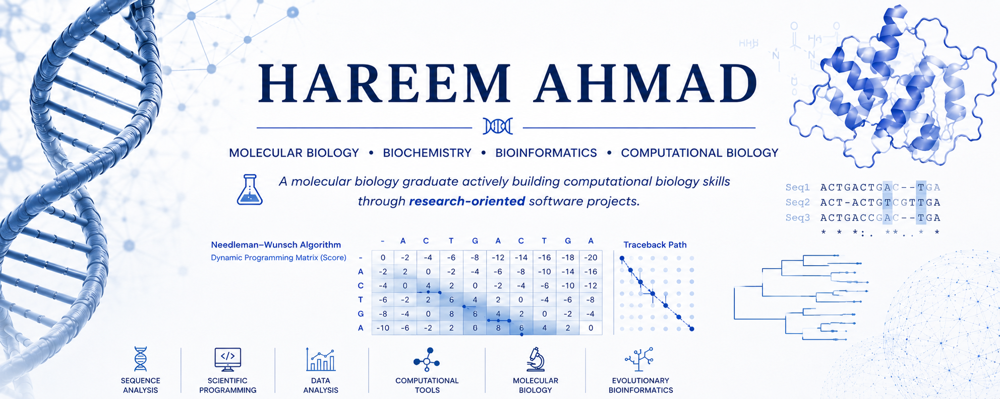

  

# Hi, I'm Hareem Ahmad 👋

### Molecular Biology | Biochemistry | Bioinformatics | Scientific Software Development

I am an **M.Sc. graduate in Molecular Biology & Biochemistry** with a growing focus on **bioinformatics and computational biology**.

My work combines molecular biology knowledge with scientific programming to better understand biological data and the algorithms that support modern genomics. I enjoy implementing classical bioinformatics algorithms from first principles, developing reproducible computational tools, and continuously expanding my skills in biological data analysis.

I am currently seeking opportunities to contribute to **research groups, PhD programs, and biotechnology organizations** working at the interface of molecular biology and computation.

---

# 🔬 Research Interests

🧬 Bioinformatics
🧬 Computational Biology
🧬 Molecular Biology
🧬 Biochemistry
🧬 Genomics
🧬 Sequence Analysis
🧬 CRISPR Technologies
🧬 Scientific Programming
🧬 AI Applications in Life Sciences

---

# 💻 Technical Skills

### Programming & Data Analysis

- Python
- NumPy
- Matplotlib
- Git
- GitHub

### Bioinformatics

- Sequence Alignment
- FASTA Processing
- Dynamic Programming Algorithms
- ORF Prediction
- Motif Analysis
- Restriction Enzyme Analysis
- Scientific Data Visualization

### Molecular Biology & Biochemistry

- PCR & qPCR
- ELISA
- SDS-PAGE
- Western Blotting
- DNA & RNA Analysis
- Molecular Cloning
- Laboratory Diagnostics

---

# 🧬 Current Projects

## Sequence Alignment Toolkit

A research-oriented implementation of the **Needleman–Wunsch Global Sequence Alignment Algorithm** developed entirely from scratch.

Highlights:

- Dynamic programming implementation
- Traceback reconstruction
- FASTA file support
- Scientific visualizations
- Publication-quality figures
- Modular Python architecture

🔗 Repository

https://github.com/HareemAhmad-Molbio/Sequence-Alignment-Toolkit

---

## FASTA Sequence Analyzer

A Python toolkit for biological sequence analysis featuring:

- ORF prediction
- GC content analysis
- Motif identification
- Restriction enzyme analysis
- Scientific visualization

🔗 Repository

https://github.com/HareemAhmad-Molbio/FASTA-Sequence-Analyzer

---

# 🌱 Currently Learning

I am actively expanding my knowledge in:

- Smith–Waterman Local Alignment
- Protein Sequence Analysis
- Structural Bioinformatics
- Variant Analysis
- Scientific Software Engineering
- Machine Learning for Biological Data

---

# 🎯 Professional Goal

My long-term goal is to contribute to research that integrates **molecular biology, computational biology, and bioinformatics** by developing reliable computational tools for biological data analysis and supporting advances in genomics and biotechnology.

I am particularly interested in research environments where laboratory science and computational methods complement one another.

---

# 📚 Areas of Interest

- Comparative Genomics
- Functional Genomics
- Computational Molecular Biology
- Biological Sequence Analysis
- CRISPR-Based Technologies
- Scientific Computing
- Reproducible Research

---

# 📈 Current Focus

- Building open-source bioinformatics software
- Strengthening algorithmic understanding through implementation from scratch
- Developing a portfolio of research-oriented computational biology projects
- Preparing for PhD opportunities in Molecular Biology, Bioinformatics, and Computational Biology

---

# 🤝 Open To

- PhD Positions
- Research Assistant Positions
- Bioinformatics Research
- Computational Biology Projects
- Biotechnology R&D Opportunities
- Scientific Collaborations

---

# 📫 Contact

📍 Darmstadt, Germany

GitHub

https://github.com/HareemAhmad-Molbio

LinkedIn

https://www.linkedin.com/in/hareemahmad12/

---

> *"I believe the best way to understand biological algorithms is to build them, validate them, and use them to solve meaningful biological problems."*